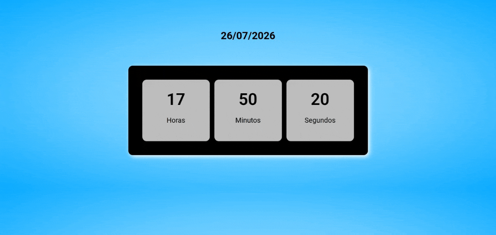

# Relógio Digital

Uma interface simples e intuitiva que simula um relógio digital exibindo data e horário atuais.

## Preview

## Tecnologias Utilizadas

- 
- 
- 

## Funcionalidades

- Exibição de data, horas, minutos e segundos em tempo real.

## O que eu aprendi

- Funções setInterval e Date;
- Manipulação do DOM;

## Demonstração

Acesse o projeto: https://guissz.github.io/Relogio-Digital/